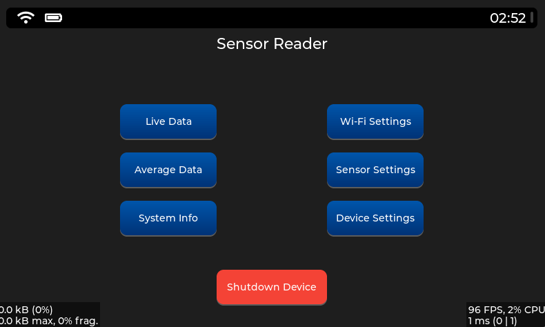
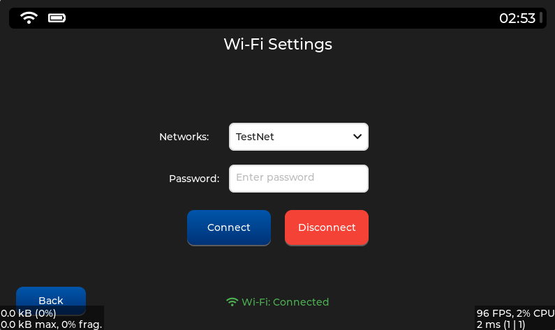
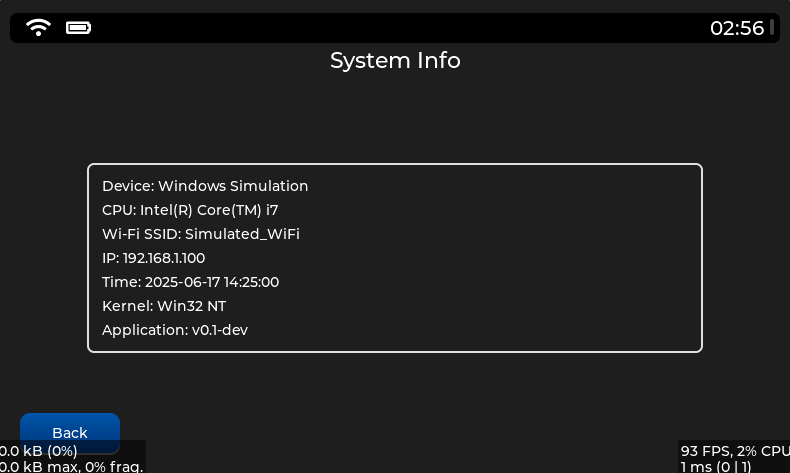
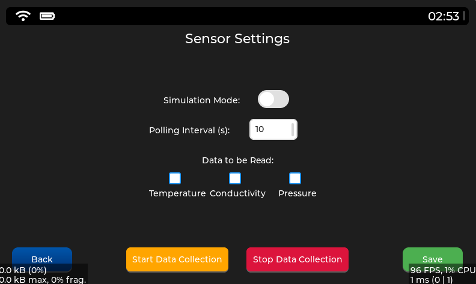
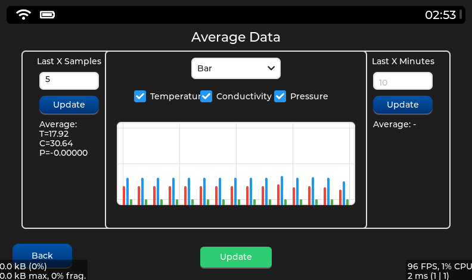
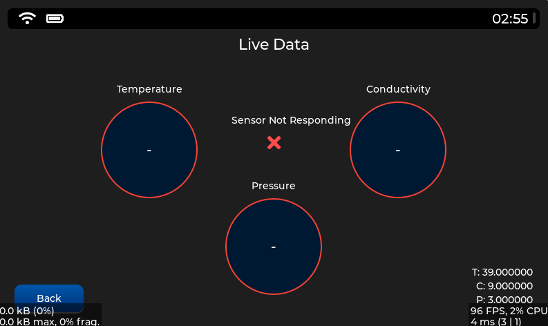
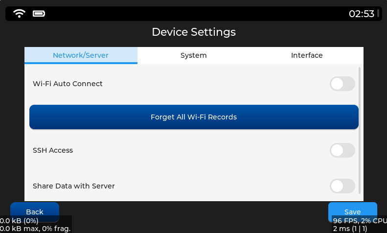
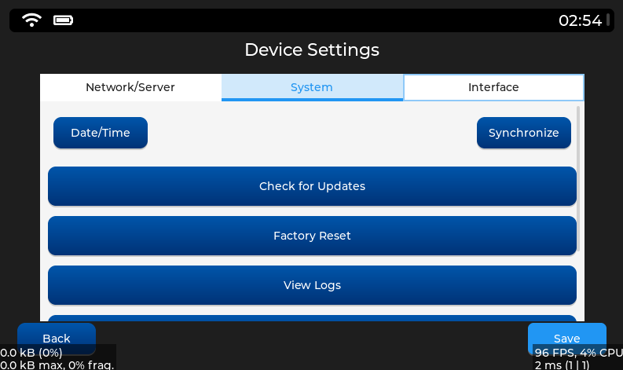

# LVGL-Based Embedded GUI Project

This project is a **graphical user interface (GUI) system built on LVGL (Light and Versatile Graphics Library)**, optimized for use on embedded Linux devices. The interface architecture is modular and page-based, featuring centralized screen transition management (`ScreenManager`), unified styling (`style.cpp`), and platform-specific backend integrations. It offers comprehensive features such as touch-friendly GUI, real-time data monitoring, Wi-Fi configuration, UART-based sensor communication, and system control components.

Designed to be **developer-friendly**, the system runs natively on real Linux devices and can also be tested cross-platform using the LVGL simulator on Windows. Its clean, readable, and reusable code structure allows easy customization or reuse in other projects. Developers can effortlessly add new screens, integrate hardware functions, or expand existing functionalities into the current framework.

---

## Purpose

The main goal of this project is to provide a **modular**, **customizable**, and **open-source** GUI infrastructure that runs on both **real embedded hardware** and **Windows-based simulators**. It integrates many essential embedded application features while offering developers a flexible and scalable foundation.

Key features of the system include:

- **Touch-optimized, user-friendly interface**  
  A minimal and modern UI designed for embedded touchscreens, built entirely with customizable LVGL widgets.

- **Real-time data processing and visualization**  
  Sensor data received over UART (or simulated) is presented live to the user, optionally recorded, and visualized via charts.

- **Comprehensive Wi-Fi configuration**  
  A full-featured Wi-Fi manager with live scanning, password entry, auto-connect, save/remove networks, and connection status display.

- **Device and system configuration**  
  Includes system settings like date/time, brightness, SSH access, screen timeout, and viewing system logs directly from the UI.

- **Modular and developer-oriented architecture**  
  Each screen and component is implemented in its own `.cpp` file, centrally managed through `ScreenManager`, and styled through a single `style.cpp`. This allows easy adaptation or extension for other projects.

---

When needed, hardware-specific functions (e.g., GPIO control, screen brightness, shutdown, logging) can be directly integrated via Linux system commands or file-based access. This makes the project not just a UI, but also a **device management panel**.

---

## Architecture Overview

This project follows a **clean, layered architecture**, separating the user interface from system logic. All components are organized to work independently yet harmoniously, ensuring easy maintenance and future extensibility.

### Modular Page System

- Each UI screen (e.g., `Live Data`, `Wi-Fi Settings`, `System Info`, etc.) is defined in a separate `.cpp` file for better readability and parallel development.
- Pages are instantiated in `main.cpp` and managed via the central `ScreenManager`.
- Developers can add new screens by defining a new `.cpp` file and registering it in `ScreenManager`.

### Screen Management: `ScreenManager`

- Implemented in `screen_manager.cpp`, the `ScreenManager` class handles all screen transitions centrally.
- Each screen is registered at startup using `register_screen()`, and activated using `show_screen(index)` or `show_screen(name)`.
- This enables:
  - **Maintainable** screen flows,
  - **Consistent** UI navigation,
  - **Scalable** architecture open to memory optimization.

### Centralized Styling: `style.cpp`

- All styling components (colors, fonts, spacing, borders, etc.) are defined in one place for consistency and maintainability.
- Reduces code duplication and enables easy global theme changes.
- Key examples:
  - `style_button` → Standard button appearance
  - `style_title` → Large bold text for page titles
  - `style_header_bar` → Fixed top bar for Wi-Fi, battery, clock

### Backend Integration (Real Device)

The project is designed to run natively on embedded Linux systems, integrating many backend operations using **direct system calls**:

- `settimeofday()` → Updates device system time from UI
- `/etc/` → Stores persistent data like settings, logs, and saved networks
- UART → Continuously reads and parses sensor data in the background
- Native commands (`reboot`, `ifconfig`, `iwlist`, `cat`, `rm`, etc.) handle system info, networking, and logging

These backend processes are **only active on real devices**. The Windows simulator uses dummy data to mimic the same behavior, ensuring consistent testing even without hardware.

---

## Platform Compatibility

The project is developed for a **custom Yocto-based Linux distribution**. Therefore, most backend operations rely on standard Linux commands and file structures.

During development, the GUI was initially tested using the **LVGL Windows Simulator**, allowing rapid, hardware-independent interface prototyping.

Thanks to platform-aware conditional code:

- On **real Linux devices**, all backend tasks (file operations, Wi-Fi connection, UART, time sync, etc.) are fully functional.
- In **Windows simulator**, the same GUI runs, but all system functions are simulated using placeholder data.

This dual-mode setup makes the project both hardware-ready and development-friendly.

---

## Home Screen and Navigation



The main menu features six interactive buttons (screens):

1. Live Data  
2. Wi-Fi Settings  
3. Average Data  
4. Sensor Settings  
5. System Info  
6. Device Settings  

Additionally, a **"Shutdown Device"** button is included.

All screens share a common **header bar** displaying:

- Wi-Fi connection status
- Static battery icon
- Real-time device clock

---

## Page Details

### Wi-Fi Settings



- Scans and lists available networks
- Allows password entry and connection attempts
- Successful connections are stored in `/etc/`
- Can disconnect and monitor connection status live

### System Info



- Updates every 15 seconds using Linux system commands:
  - Device name, CPU, IP, SSID, Date/Time, Kernel version, App version

### Sensor Settings



- Simulation mode ON/OFF
- Reads sensor data over UART
- Reading interval (seconds)
- Selectable values to display: temperature, conductivity, pressure
- Start / Stop / Save buttons
- Settings saved to file

### Average Data



- Averages calculated based on:
  - Last X entries
  - Last X minutes
- Chart types: Line, Bar, Scatter
- User selects which parameters to visualize


### Live Data



- Displays real-time sensor values:
  - Temperature
  - Conductivity
  - Pressure
- Each value is shown inside a styled circular widget.
- The data is updated every second via a background timer.
- If no sensor data is available (all values are zero), an error icon is shown and status message changes.
- Colored border animations (green/red) indicate sensor status.
- Debug labels at the bottom show raw float values with prefixes (T:, C:, P:).


### Device Settings

Organized into 3 tabs:



--- 



#### Network / Server

- Toggle auto Wi-Fi connection
- Forget saved networks
- Toggle SSH access
- Toggle data sharing with server

#### System

- Date and time settings
- Sync button (NTP-based backend can be added)
- Check for updates (currently always "up to date")
- Factory reset
- View or clear logs
- Screen timeout setting

#### Interface

- Brightness adjustment (slider)
- Toggle memory saving mode
- Toggle low power mode

---

## Background Services

- **Auto Wi-Fi Reconnect**  
  Compares `/etc/` saved networks with scanned ones and reconnects automatically. Deletes network if connection fails.

- **Sensor Data Logging**  
  Sensor readings are timestamped and stored. The Average Data screen can later access them for analysis and visualization.

- **System Logging**  
  Key operations are logged to `/etc/logs.txt`. Users can read or clear them from the UI.

---

## Project Directory Structure

```plaintext
embedded-lvgl-ui-example/
├── README.md                  # Main project documentation (English)
├── README_TR.md               # Main project documentation (Turkish)
├── src/                       # Source code for both language versions
│   ├── EN/                    # English version of the UI application
│   └── TR/                    # Turkish version of the UI application
├── docs/
│   ├── EN/                    # English documentation
│   │   ├── architecture.md
│   │   ├── usage.md
│   │   └── todo.md
│   ├── TR/                    # Turkish documentation
│   │   ├── architecture_TR.md
│   │   ├── usage_TR.md
│   │   └── todo_TR.md
│   └── screenshots/           # UI screenshots for documentation             
```

### Description of Key Folders and Files

- **README.md / README_TR.md**  
  Entry point documentation files for the project in English and Turkish.

- **src/EN/** and **src/TR/**  
  Separate implementations of the GUI application for English and Turkish. Each includes its own source files (`.cpp`, `.h`, `CMakeLists.txt`, etc.) and localized content.

- **docs/EN/**  
  English-language technical documentation:
  - `architecture.md`: High-level project structure and architecture  
  - `usage.md`: Setup and usage guide  
  - `todo.md`: Known issues and future plans

- **docs/TR/**  
  Turkish translations of all documents found in `docs/EN/`.

- **docs/screenshots/**  
  Visual examples and UI captures used in documentation.


## Notes

- This project is still **under active development**. While most UI components are functional, some system features (e.g., brightness control, SSH toggle, power-saving modes) are currently UI-only and do not yet have working backend implementations.

- The architecture is designed to be **scalable and modular**, making it suitable for both **educational use** and **professional embedded GUI development**.

- Backend functionality is **only active on real Linux devices**. The Windows simulator is used solely for testing the GUI and utilizes **dummy data** in place of real system functions.

- The codebase is structured to allow developers to:
  - Easily add new screens or configuration sections,
  - Reuse existing modules in other projects,
  - Integrate platform-specific system calls with minimal effort.

- Known limitations, planned features, and suggestions for improvement are listed in the [todo.md](docs/todo.md) file, which serves as a roadmap and guide for contributors.