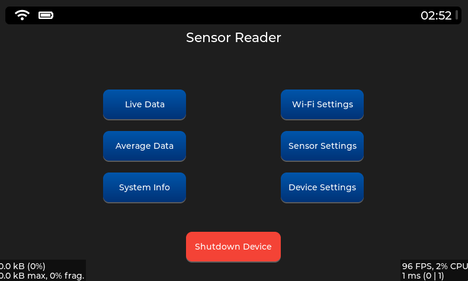
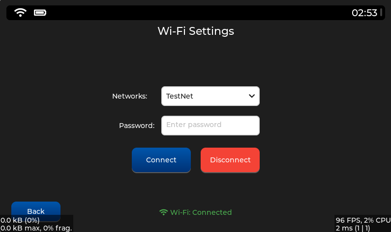
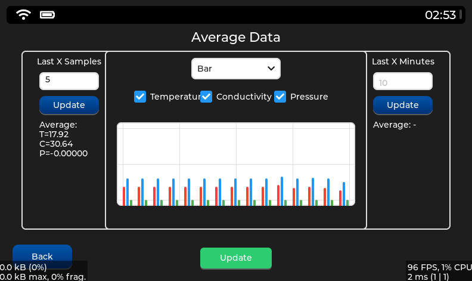
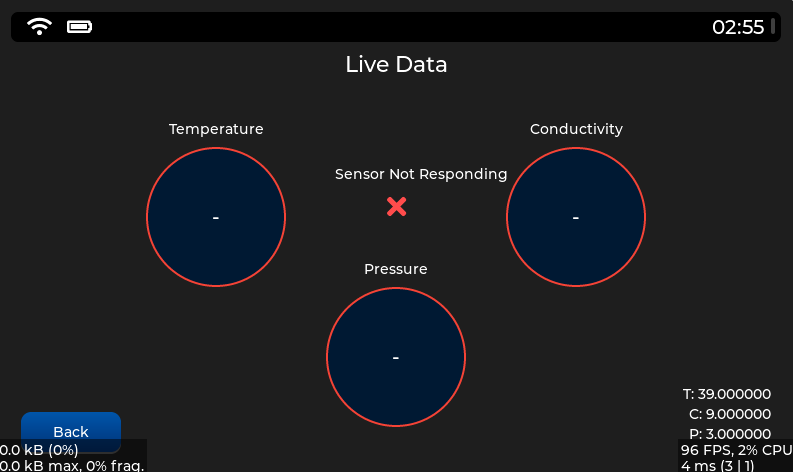
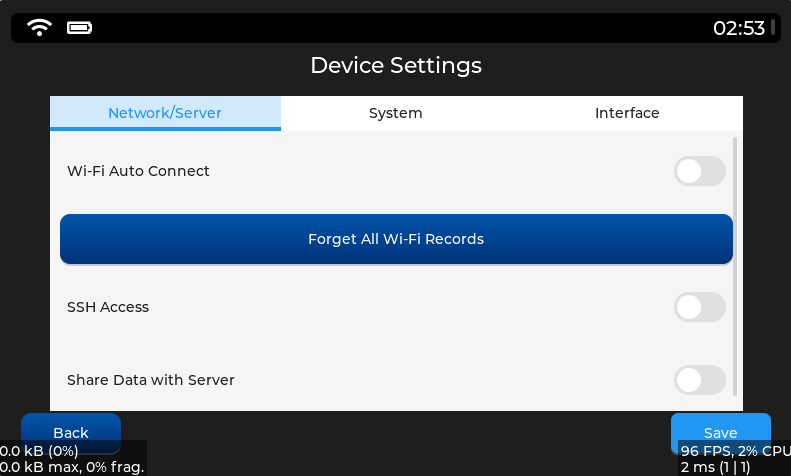
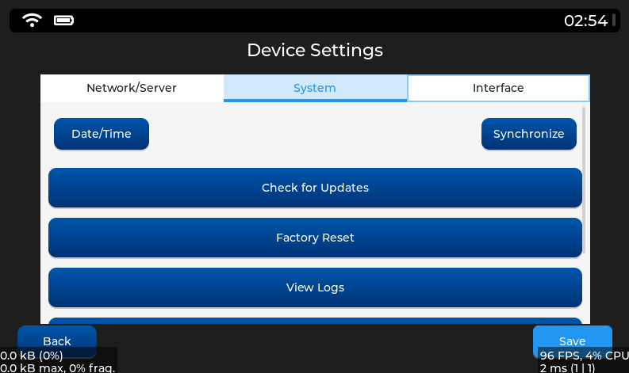

# LVGL Tabanlı Gömülü Arayüz Projesi

Bu proje, **LVGL (Light and Versatile Graphics Library)** tabanlı olarak geliştirilmiş, gömülü Linux cihazlarda çalışmak üzere optimize edilmiş bir grafik kullanıcı arayüzü sistemidir. Arayüz yapısı; sayfa bazlı modüler mimarisi, merkezi ekran geçiş yönetimi (`ScreenManager`), stil bileşenlerinin tek merkezden kontrol edildiği yapı (`style.cpp`) ve platforma özel sistem çağrılarıyla desteklenmiş backend entegrasyonları ile birlikte gelir. Sistem; dokunmatik uyumlu kullanıcı arayüzü, gerçek zamanlı veri izleme, Wi-Fi yapılandırması, UART üzerinden sensör haberleşmesi ve sistem kontrol bileşenleri gibi temel gömülü işlevleri kapsamlı bir şekilde sunar.

Proje, **geliştirici dostu** olacak şekilde tasarlanmış; hem gerçek Linux cihazlar üzerinde doğrudan çalışacak altyapıya hem de Windows üzerinde LVGL simülatörü ile test edilebilecek platform bağımsız yapıya sahiptir. Kod yapısı; açık, okunabilir ve yeniden kullanılabilir olacak şekilde tasarlandığı için, farklı projelere temel oluşturabilecek veya kolayca özelleştirilebilecek bir iskelet sunar. Bu sayede geliştiriciler, ihtiyaç duydukları yeni ekranları, sistem işlevlerini ya da donanım bileşenlerini mevcut yapıya entegre etmekte hiçbir zorluk yaşamaz.


---

## Amaç

Bu projenin temel amacı, **gerçek gömülü donanımlarda** ya da **Windows ortamında simülatör üzerinden** çalışabilecek, **modüler**, **özelleştirilebilir** ve **açık kaynaklı** bir grafik kullanıcı arayüzü altyapısı sunmaktır. Sistem, gömülü uygulamalarda sık karşılaşılan birçok işlevi entegre biçimde sunarken; geliştiricilere esnek, yeniden kullanılabilir ve genişletilebilir bir temel sağlamayı hedefler.

Projenin dikkat çeken başlıca özellikleri şunlardır:

- **Dokunmatik uyumlu kullanıcı dostu arayüz**  
  Modern gömülü cihazlar için optimize edilmiş, sade bir kullanıcı arayüzü tasarımı sunar. Tüm ekran bileşenleri LVGL'nin özelleştirilebilir widget'larıyla oluşturulmuştur.

- **Gerçek zamanlı veri işleme ve görselleştirme**  
  UART üzerinden okunan (veya simüle edilen) sensör verileri anlık olarak kullanıcıya sunulur; grafiklerle desteklenir. Sistem, istenirse bu verileri saklayarak geçmiş analizleri de yapılabilir hale getirir.

- **Wi-Fi yapılandırma desteği**  
  Anlık ağ taraması, şifreyle bağlanma, otomatik bağlantı, ağları kaydetme/silme gibi birçok işlevle donatılmış tam teşekküllü bir Wi-Fi yönetim arayüzü içerir.

- **Cihaz ve sistem ayarlarının kontrolü**  
  Tarih/saat yönetimi, parlaklık kontrolü, SSH erişimi, ekran zaman aşımı ve sistem log görüntüleme gibi temel sistem ayarları doğrudan arayüz üzerinden yapılandırılabilir.

- **Modüler ve geliştirici dostu yapı**  
  Her bir ekran ve bileşen bağımsız `.cpp` dosyalarında tanımlanmış, `ScreenManager` ile merkezi olarak yönetilen, stil yapılarını ayrı tutan, temiz bir mimari sunulmuştur. Bu sayede hem yeni sayfa eklemek hem de mevcut yapıyı farklı projelere uyarlamak son derece kolaydır.

---

İhtiyaç duyulduğunda donanıma özel işlevler (örneğin GPIO, ekran parlaklığı kontrolü, sistem kapatma, loglama vs.) arka plandaki Linux sistem komutları veya dosya yapıları ile doğrudan entegre edilebilir. Bu sayede proje yalnızca bir arayüz değil, aynı zamanda **cihaz yönetim paneli** işlevi de görebilecek esnekliğe sahiptir.


---

## Mimarinin Temelleri

Bu projede, kullanıcı arayüzü ve sistem arka planı birbirinden ayrılmış, **temiz katmanlara sahip**, sürdürülebilir bir yapı tercih edilmiştir. Tüm bileşenler birbirinden bağımsız ama koordineli çalışacak şekilde organize edilmiştir. Bu yaklaşım, hem bakım kolaylığı sağlar hem de özelleştirme ve genişletme işlemlerini son derece pratik hale getirir.

### Modüler Sayfa Sistemi

- Her bir kullanıcı arayüzü ekranı (örneğin: `Anlık Veriler`, `Wi-Fi Ayarları`, `Sistem Bilgisi`, vb.) ayrı `.cpp` dosyalarında tanımlanmıştır. Bu, hem okunabilirliği artırır hem de ekip içi iş bölümü için avantaj sağlar.
- Sayfalar `main.cpp` içerisinden tek noktadan oluşturulur ve `ScreenManager` aracılığıyla kontrol edilir. Bu yapı, tüm ekran akışının merkezi şekilde izlenebilmesini ve düzenlenebilmesini mümkün kılar.
- Geliştirici, yeni bir ekran eklemek istediğinde yalnızca ilgili `.cpp` dosyasını tanımlayıp `ScreenManager` üzerinden kaydederek projeye entegre edebilir.

### Ekran Yönetimi: `ScreenManager`

- `screen_manager.cpp` dosyasında tanımlı `ScreenManager` sınıfı, ekranlar arası geçişleri merkezi olarak yöneten özel bir kontrol katmanıdır.
- Her ekran uygulama başlangıcında `register_screen()` ile kayıt edilir. Ardından `show_screen(index)` veya `show_screen(name)` çağrılarıyla istenen ekran aktif hale getirilir.
- Bu yapı sayesinde uygulama mimarisi:
  - Karmaşık ekran yapılarında bile **kontrol edilebilir**,
  - UI akışı boyunca **tutarlı**,  
  - Genişletilmeye açık **ölçeklenebilir** bir form kazanır. Bellek yönetimi geliştirmelerine açıktır.

### Stil Sistemi: `style.cpp`

- Tüm stil bileşenleri (renk paletleri, fontlar, boşluklar, kenarlıklar vb.), merkezi bir dosyada (`style.cpp`) tanımlanarak UI genelinde bütünlük sağlanır.
- Kod tekrarını azaltır, temaya uygun tek noktadan değişiklik yapılmasına imkân verir.
- Öne çıkan örnek stiller:
  - `style_button` → Tüm butonlar için standart görünüm
  - `style_title` → Sayfa başlıklarında kullanılan büyük yazı tipi ve kalınlık
  - `style_header_bar` → Üst kısımda yer alan sabit bar (Wi-Fi, pil, saat) stili

### Backend Entegrasyonu (Gerçek Cihaz)

Proje, gerçek gömülü sistemlerde çalışacak şekilde donanım seviyesinde yapılandırılmıştır. Arayüzdeki birçok işlem, arka planda **doğrudan Linux sistem çağrıları** ile entegre çalışır:

- `settimeofday()` → Kullanıcının ayarladığı tarih/saat bilgisi cihaz sistem saatine aktarılır.
- `/etc/` → Ayarlar, loglar ve kayıtlı ağlar gibi kalıcı bilgiler burada saklanır.
- UART haberleşmesi → Sensör verileri arka planda seri port üzerinden alınır ve işlenir.
- Sistem komutları (`reboot`, `ifconfig`, `iwlist`, `cat`, `rm` vs.) doğrudan çalıştırılarak ağ, sistem bilgisi ve log yönetimi gerçekleştirilir.

Backend işlemler yalnızca gerçek cihazda aktiftir. Windows simülatör ortamı, aynı arayüzle çalışacak şekilde yapılandırılmış olsa da bu işlemler yerine sahte veriler kullanır. Böylece proje hem test hem de üretim aşamasına uygun hale gelir.


### Platform Uyumluluğu

Proje, **Yocto tabanlı özel bir Linux dağıtımı** üzerinde çalışmak üzere geliştirilmiştir. Bu nedenle, ağ yönetimi, sistem saat ayarı, UART haberleşmesi, dosya işlemleri ve log yönetimi gibi birçok işlem doğrudan temel Linux komutları ile gerçekleştirilir.

Geliştirme sürecinde, kullanıcı arayüzünün tasarımı ve testleri öncelikle **LVGL Windows Simulator** üzerinde gerçekleştirilmiştir. Bu yaklaşım sayesinde, gerçek donanıma ihtiyaç duymadan kullanıcı arayüzü bileşenleri hızlı ve platformdan bağımsız olarak test edilebilmiştir.

Projede platform farkları dikkate alınarak geliştirilen özel yapı sayesinde:

- **Gerçek Linux cihazlarda** tam fonksiyonel backend işlemleri (dosya okuma/yazma, Wi-Fi bağlantı yönetimi, UART üzerinden veri alma, sistem saatini değiştirme vb.) aktif hale gelir.
- **Windows simülasyon ortamında** ise aynı arayüz yapısı korunur, ancak tüm sistemsel işlemler dummy (örnek) veriler ile taklit edilir. Böylece geliştirme süreci cihazdan bağımsız ilerletilebilir.

Bu yapı, projeyi hem gömülü sistemlerde kullanılabilir bir ürün haline getirir, hem de platformdan bağımsız olarak sürdürülebilir bir geliştirme deneyimi sunar.

---

## Ana Sayfa ve Sayfalar



Ana ekranda 6 adet buton (sayfa) yer alır:

1. Anlık Veriler
2. Wi-Fi Ayarları
3. Ortalama Veriler
4. Sensör Ayarları
5. Sistem Bilgisi
6. Cihaz Ayarları

Ek olarak "Cihazı Kapat" butonu bulunur.

Her sayfada ortak bir **header bar** yer alır:

- Wi-Fi bağlantı durumu ikonu
- Sabit pil ikonu
- Gerçek zamanlı güncellenen cihaz saati

---

## Sayfa Detayları

### Wi-Fi Ayarları



- Mevcut ağlar taranarak listelenir
- Şifre girilerek bağlantı denenebilir
- Başarılı bağlantılar `/etc/` altında kaydedilir
- Bağlantıyı kesme ve durumu canlı gösterme özelliği vardır

### Sistem Bilgisi


- Linux sistem komutlarıyla elde edilen bilgiler 15 saniyede bir güncellenir:
  - Cihaz adı, CPU, IP, SSID, Tarih/Saat, Kernel versiyonu, Uygulama versiyonu

### Sensör Ayarları


- Simülasyon modu (ON/OFF)
- UART üzerinden veri okuma
- Okuma periyodu (saniye)
- Gösterilecek veriler: sıcaklık, iletkenlik, basınç
- "Başlat", "Durdur", "Kaydet" butonları
- Ayarlar dosyaya kaydedilir

### Ortalama Veriler



- Son X veri veya son X dakika seçilerek analiz yapılır
- Grafik tipi seçimi: çizgi, bar, scatter
- Hangi parametreler grafikte gösterileceği belirlenebilir

### Anlık Veriler



- Gerçek zamanlı sensör değerlerini gösterir:
  - Sıcaklık  
  - İletkenlik  
  - Basınç  
- Her değer, stilize edilmiş dairesel widget'lar içinde gösterilir.
- Veriler arka planda çalışan bir zamanlayıcı ile her saniye güncellenir.
- Sensör verisi okunamıyorsa (tüm değerler sıfırsa), hata simgesi görünür ve durum mesajı değişir.
- Daire kenarlarında yeşil/kırmızı yanıp sönme animasyonu ile sensör durumu belirtilir.
- Alt kısımda yer alan debug etiketleri (T:, C:, P:) ham float değerlerini gösterir.

### Cihaz Ayarları

3 sekmeye ayrılmıştır:



--- 




#### Ağ/Sunucu
- Wi-Fi otomatik bağlan aç/kapa (yalnızca buton)
- Ağ kayıtlarını unut
- SSH erişimi aç/kapat (yalnızca buton)
- Sunucuyla veri paylaşımı (yalnızca buton)

#### Sistem
- Tarih/Saat ayarı
- Verileri eşitleme butonu (NTP olan sistemlerde backend yazılabilir.)
- Güncellemeleri kontrol et (sabit "güncel" mesajı)
- Fabrika ayarlarına dön (yalnızca buton)
- Log görüntüleme ve temizleme
- Ekran zaman aşımı (yalnızca buton)

#### Arayüz
- Parlaklık ayarı (slider) (yalnızca buton)
- Bellek tasarruf modu (ON/OFF) (yalnızca buton)
- Düşük güç tüketimi modu (ON/OFF) (yalnızca buton)

---

## Arka Plan Servisleri

- **Wi-Fi Otomatik Bağlantı**  
  `/etc/` içindeki kayıtlı ağlarla anlık tarananlar kıyaslanır ve eşleşen ağa otomatik bağlanma denenir. Bağlantı başarısızsa ağ silinir.

- **Sensör Kayıtları**  
  Sensör verileri zaman damgası ile kaydedilir. Ortalama Veriler sayfasından kullanıcı gerekli ortalama alma işlemlerini yapabilir veya verileri grafik olarak okuyabilir.

- **Loglama**  
  Belirli işlemler `/etc/logs.txt` dosyasına kaydedilir. Kullanıcı bu logları okuyabilir veya silebilir.

---

## Proje Dizin Yapısı

```plaintext
embedded-lvgl-ui-example/
├── README.md                  # Proje açıklaması (İngilizce)
├── README_TR.md               # Proje açıklaması (Türkçe)
├── src/                       # Uygulama kaynak kodları (her iki dil için)
│   ├── EN/                    # İngilizce arayüz uygulaması
│   └── TR/                    # Türkçe arayüz uygulaması
├── docs/
│   ├── EN/                    # İngilizce dokümantasyon
│   │   ├── architecture.md
│   │   ├── usage.md
│   │   └── todo.md
│   ├── TR/                    # Türkçe dokümantasyonlar
│   │   ├── architecture_TR.md
│   │   ├── usage_TR.md
│   │   └── todo_TR.md
│   └── screenshots/           # Ekran görüntüleri (dokümantasyon için)
```
### Klasörler ve Dosyaların Açıklamaları

- **README.md / README_TR.md**  
  Projenin giriş dokümantasyon dosyalarıdır. README.md İngilizce, README_TR.md Türkçedir.

- **src/EN/** ve **src/TR/**  
  GUI uygulamasının İngilizce ve Türkçe ayrı sürümlerini içerir. Her biri kendi kaynak dosyalarını (`.cpp`, `.h`, `CMakeLists.txt` vb.) ve diline özel içerikleri barındırır.

- **docs/EN/**  
  İngilizce teknik dokümantasyon içerir:
  - `architecture.md`: Projenin genel yapısı ve mimarisi  
  - `usage.md`: Kurulum ve kullanım rehberi  
  - `todo.md`: Bilinen eksikler ve geliştirme planları

- **docs/TR/**  
  `docs/EN/` klasöründeki tüm belgelerin Türkçe çevirilerini içerir.

- **docs/screenshots/**  
  Dokümantasyonlarda kullanılan arayüz görüntülerini içerir.
  
## Notlar

- Bu proje halen **aktif geliştirme sürecindedir**. Arayüz bileşenleri büyük ölçüde tamamlanmış olsa da; bazı sistem işlevleri (örneğin: parlaklık kontrolü, SSH erişimi, güç tasarrufu modları) yalnızca arayüz düzeyinde yer almakta, backend tarafında henüz işlevsel değildir.
  
- Proje, hem **öğrenme amaçlı geliştiriciler** hem de **profesyonel gömülü sistem projeleri** için temel oluşturabilecek, **modüler ve genişletilebilir** bir mimariye sahiptir.

- Backend işlemler yalnızca gerçek Linux cihazlarda çalışacak şekilde yapılandırılmıştır. Windows ortamındaki LVGL simülatörü yalnızca kullanıcı arayüzü testleri için kullanılmakta, sistemsel fonksiyonlar yerine sahte (dummy) verilerle çalışmaktadır.

- Kod yapısı, geliştiricilerin:
  - Yeni ekranlar veya ayar bölümleri eklemesine,
  - Mevcut modülleri başka projelere aktarmasına,
  - Platforma özel sistem çağrılarını entegre etmesine  
  olanak sağlayacak şekilde açık, sade ve ölçeklenebilir biçimde tasarlanmıştır.

- Bilinen eksikler, yapılacaklar listesi ve önerilen geliştirmeler [todo.md](docs/todo.md) dosyasında yer almaktadır. Bu dosya, projeye katkı sağlamak isteyen geliştiriciler için bir rehber niteliğindedir.
